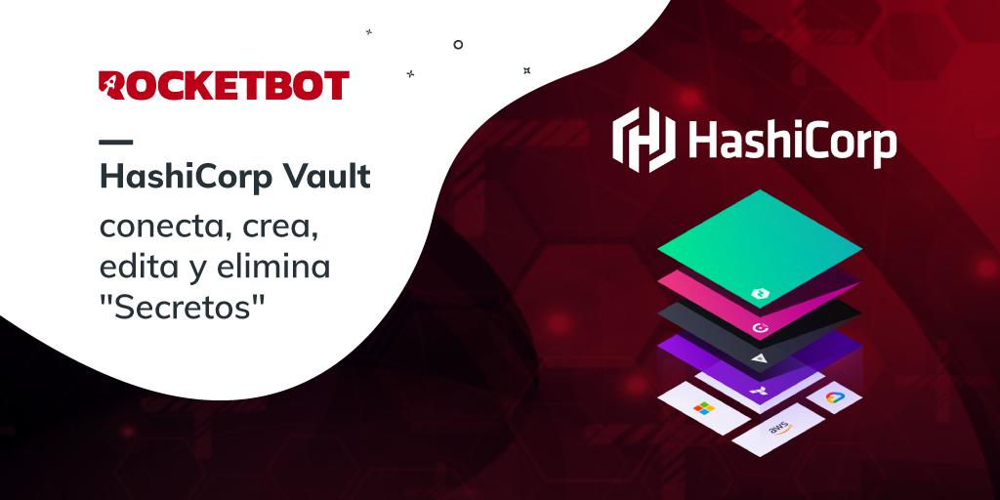
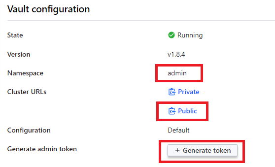
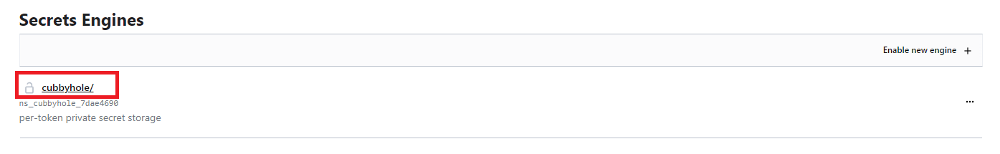

# HashiCorp Vault
  
Interact with HashiCorp. Create, update and delete secrets in HashiCorp Vault.  
  

## Como instalar este módulo
  
__Descarga__ e __instala__ el contenido en la carpeta 'modules' en la ruta de rocketbot.

## Como usar este módulo
  
Para usar este módulo, tienes que tener creado un Vault en HashiCorp (puede ser On-Premise o Cloud).
Necesitarás saber la URL del cluster, el namespace donde se encuentran los secretos, el token del usuario con
el cual se desea ingresar y el mount point de los secretos (secrets engines).

## Descripción de los comandos

### Conectar a HashiCorp Vault
  
Conectar a HashiCorp Vault para poder interactuar
|Parámetros|Descripción|ejemplo|
| --- | --- | --- |
|URL|Dominio y puerto del servidor que contiene HashiCorp Vault.|https://vault-cluster.vault.4c5500a1-241d-4c62-lo4o-252bfa8d4373.aws.hashicorp.cloud:8200|
|Token|Token del usuario de HashiCorp Vault (puede ser admin).|s.tgLfeJJWc4Vypf124GVrZCLK.PrajM|
|Namespace|Namespace encontrado en la configuracion del Vault.|admin|
|Asignar resultado a variable|Variable donde se desea saber el resultado de la accion.|Variable|

### Leer Secretos
  
Hace una peticion para leer secretos almacenados en HashiCorp Vault
|Parámetros|Descripción|ejemplo|
| --- | --- | --- |
|Path|Ruta especificada en la creacion de los secretos.|rocket|
|Mount Point|Mount Point en donde se encuentran todos los secretos almacenados.|cubbyhole|
|Asignar resultado a variable|Variable donde se desea saber el resultado de la accion.|Variable|

### Crear o Modificar Secretos
  
Hace una peticion para crear o modificar secretos almacenados en HashiCorp Vault
|Parámetros|Descripción|ejemplo|
| --- | --- | --- |
|Path|Ruta especificada en la creacion de los secretos.|rocket|
|Mount Point|Mount Point en donde se encuentran todos los secretos almacenados.|cubbyhole|
|Secreto (conjunto key-value)|Conjunto par de key-value que se desea almacenar (expresado en diccionario de python con comillas simples).|{'key':'value'}|
|Asignar resultado a variable|Variable donde se desea saber el resultado de la accion.|Variable|

### Borrar Secretos
  
Hace una peticion para borrar secretos almacenados en HashiCorp Vault
|Parámetros|Descripción|ejemplo|
| --- | --- | --- |
|Path|Ruta especificada en la creacion de los secretos.|rocket|
|Mount Point|Mount Point en donde se encuentran todos los secretos almacenados.|cubbyhole|
|Asignar resultado a variable|Variable donde se desea saber el resultado de la accion.|Variable|
